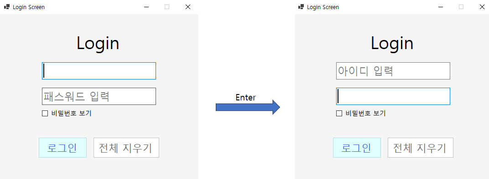
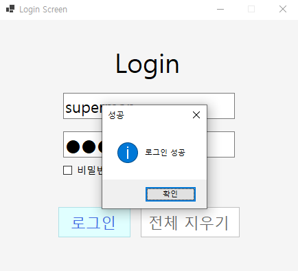
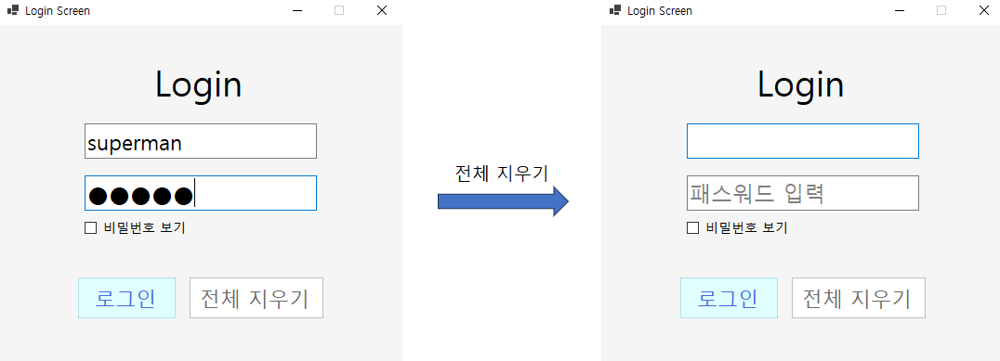
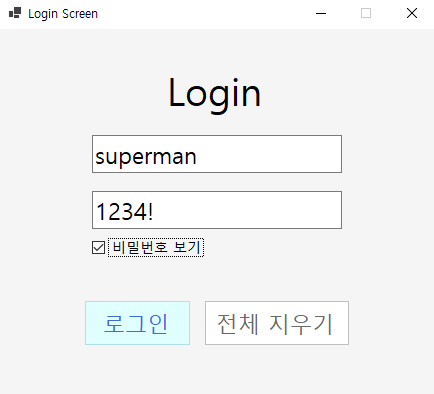
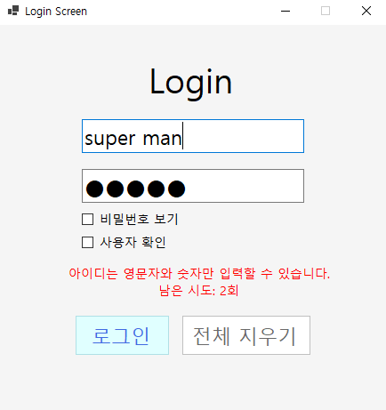
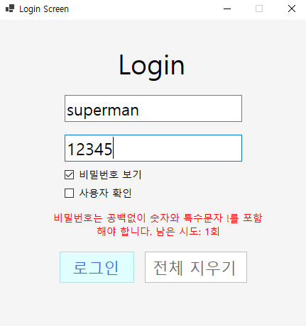
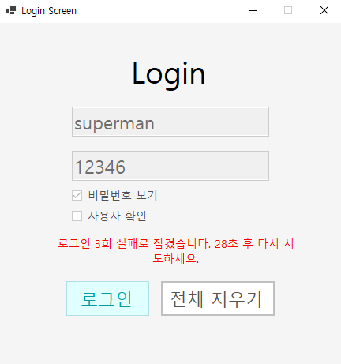
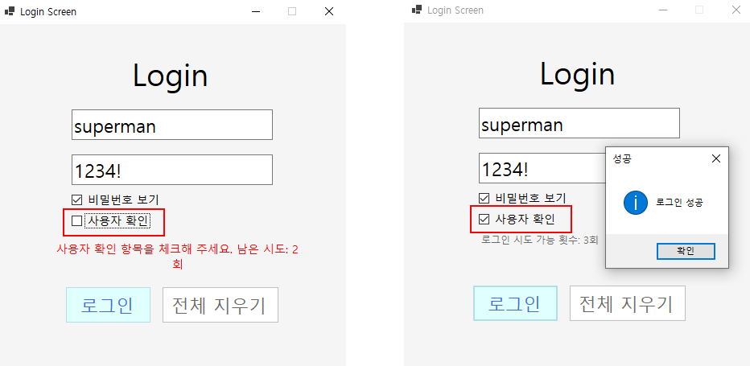

# (C# 코딩) LoginScreen

## 목차
1. 개요
2. 과제 1
3. 과제 2
4. 과제 3
5. 과제 4

---
## 개요
C# WinForms를 사용하여 로그인 화면을 단계적으로 구현하는 실습 프로젝트이다.
기본 로그인 기능부터 사용자 편의성(UX) 개선, 오류 처리, 입력값 검증, 로그인 시도 제한 기능까지 구현한다.

- 사용한 플랫폼: C#, .NET Windows Forms, Visual Studio 2026
- 사용한 주요 컨트롤: Label, TextBox, Button, Timer, CheckBox

## 과제 1

### 실행 화면

### 과제 내용
- Label 1개, TextBox 2개, Button 1개로 기본 UI 구성
- 아이디/비밀번호 Placeholder 표시
- 정확한 계정(superman / 1234!)일 때만 로그인 성공
- 성공/실패를 MessageBox로 표시

### 구현 내용과 기능 설명
- Label, TextBox 2개, Button 1개를 사용하여 로그인 화면을 구성했습니다.
- 아이디와 비밀번호 입력창에 Placeholder 기능을 구현했습니다.
- 비밀번호 입력 시 문자 대신 ● 형태로 표시되도록 마스킹 처리했습니다.
- 로그인 버튼 클릭 시 입력값을 검사합니다.
- 아이디가 superman이고 비밀번호가 1234!인 경우 로그인 성공 MessageBox를 표시합니다.
- 계정 정보가 일치하지 않으면 로그인 실패 MessageBox를 표시합니다.

## 과제 2

### 실행 화면

### 과제 내용
- 로그인 실패 시 MessageBox 대신 화면에 오류 메시지 표시
- Label의 Visible 속성을 이용하여 오류 메시지 표시 및 숨김 처리

### 구현 내용과 기능 설명
- 계정 정보가 일치하지 않으면 화면 하단의 오류 Label을 표시합니다.
- 오류 메시지는 빨간색으로 표시되며 Label의 Visible 속성을 사용하여 보이기/숨기기를 구현했습니다.
- 사용자가 다시 입력을 시작하면 오류 메시지가 자동으로 숨겨지도록 처리했습니다.

## 과제 3

### 실행 화면

### 과제 내용
- Enter 키를 이용한 로그인 입력 흐름 개선
- 아이디 입력 후 Enter 키를 누르면 비밀번호 입력창으로 이동
- 비밀번호 입력 후 Enter 키를 누르면 로그인 실행
- 전체 지우기 기능 추가
- 비밀번호 보기/숨기기 기능 추가

### 구현 내용과 기능 설명
- 아이디 입력창에서 Enter 키를 누르면 비밀번호 입력창으로 포커스가 이동합니다.
- 비밀번호 입력창에서 Enter 키를 누르면 로그인 버튼 클릭과 동일한 동작이 실행됩니다.
- 전체 지우기 버튼을 누르면 아이디와 비밀번호 입력 내용을 모두 초기화합니다.
- 비밀번호 보기 체크박스를 선택하면 입력한 비밀번호를 확인할 수 있습니다.
- 체크박스 해제 시 비밀번호가 다시 마스킹되어 표시됩니다.

## 과제 4

### 실행 화면

### 과제 내용
- 아이디 입력값 유효성 검사 기능 추가
- 비밀번호 규칙 검사 기능 추가
- 로그인 실패 횟수 제한 기능 추가
- 일정 횟수 이상 실패 시 일정 시간 동안 로그인 제한
- 사용자 확인(CheckBox) 절차 추가

### 구현 내용과 기능 설명
- 아이디 입력시 허용되지 않는 문자가 포함되어 있는지 검사합니다.
- 비밀번호에 필수 문자 포함 여부를 확인하고 규칙에 맞지 않으면 로그인할 수 없습니다.
- 로그인 실패 횟수를 카운트하여 관리합니다.
- 지정된 횟수 이상 로그인에 실패하면 일정 시간 동안 로그인 버튼을 비활성화합니다.
- 제한 시간이 지나면 다시 로그인을 시도할 수 있습니다.
- 로그인 전 사용자 확인 체크박스를 선택해야 로그인을 진행할 수 있도록 구현했습니다.