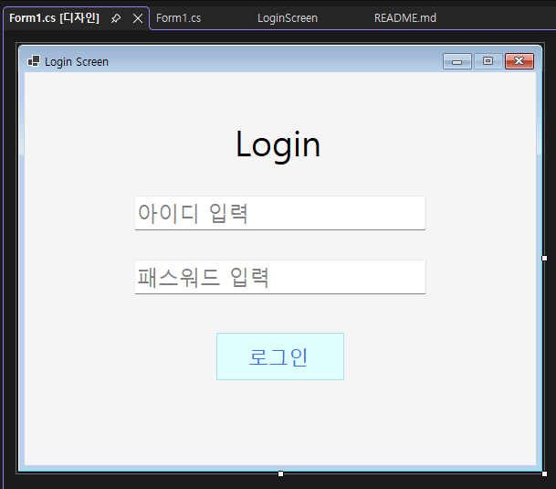
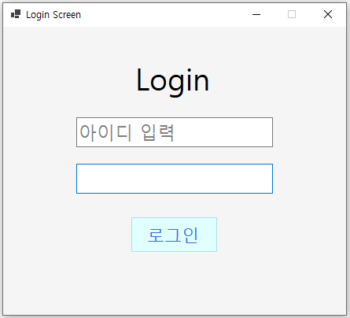
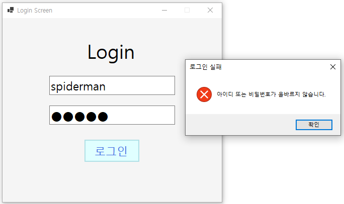
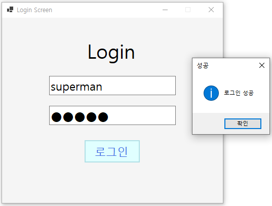
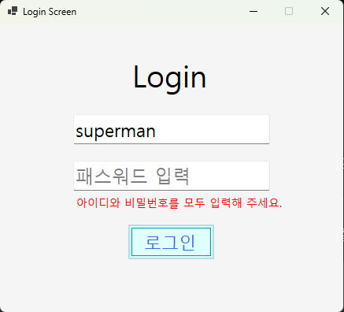
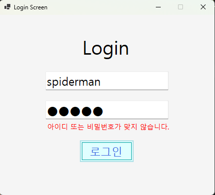
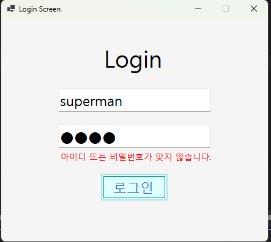
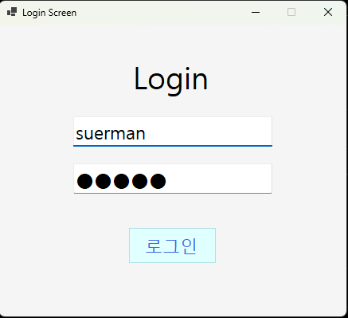

# (C# 코딩) LoginScreen

## 목차
1. 개요
2. 과제 1
3. 과제 2
4. 과제 3
5. 과제 4

---
## 개요
C# WinForms를 사용하여 로그인 화면을 단계적으로 구현하는 실습 프로젝트이다.
기본 로그인 기능부터 사용자 편의성(UX) 개선, 오류 처리, 입력값 검증, 로그인 시도 제한 기능까지 구현한다.

- 사용한 플랫폼: C#, .NET Windows Forms, Visual Studio 2026
- 사용한 주요 컨트롤: Label, TextBox, Button

## 과제 1

### 실행 화면

### 과제 내용
- Label 1개, TextBox 2개, Button 1개로 기본 UI 구성
- 아이디/비밀번호 Placeholder 표시
- 정확한 계정(superman / 1234!)일 때만 로그인 성공
- 성공/실패를 MessageBox로 표시

### 구현 내용과 기능 설명
- Label, TextBox 2개, Button 1개를 사용하여 로그인 화면을 구성했습니다.
- 아이디와 비밀번호 입력창에 Placeholder 기능을 구현했습니다.
- 비밀번호 입력 시 문자 대신 ● 형태로 표시되도록 마스킹 처리했습니다.
- 로그인 버튼 클릭 시 입력값을 검사합니다.
- 아이디가 superman이고 비밀번호가 1234!인 경우 로그인 성공 MessageBox를 표시합니다.
- 계정 정보가 일치하지 않으면 로그인 실패 MessageBox를 표시합니다.

## 과제 2

### 실행 화면

### 과제 내용
- 로그인 실패 시 MessageBox 대신 화면에 오류 메시지 표시
- Label의 Visible 속성을 이용하여 오류 메시지 표시 및 숨김 처리

### 구현 내용과 기능 설명
- 계정 정보가 일치하지 않으면 화면 하단의 오류 Label을 표시합니다.
- 오류 메시지는 빨간색으로 표시되며 Label의 Visible 속성을 사용하여 보이기/숨기기를 구현했습니다.
- 사용자가 다시 입력을 시작하면 오류 메시지가 자동으로 숨겨지도록 처리했습니다.
